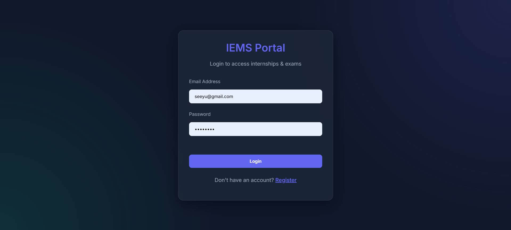
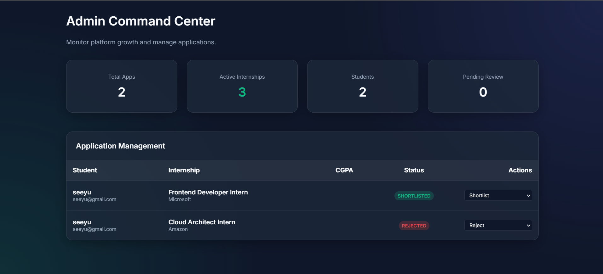
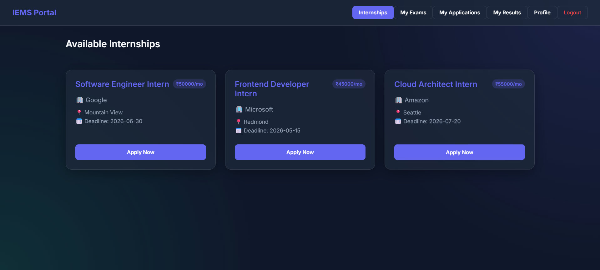
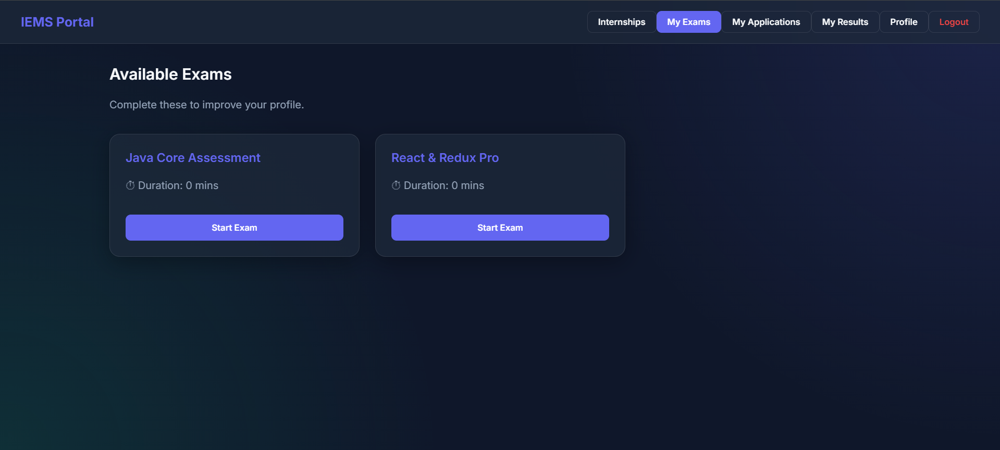
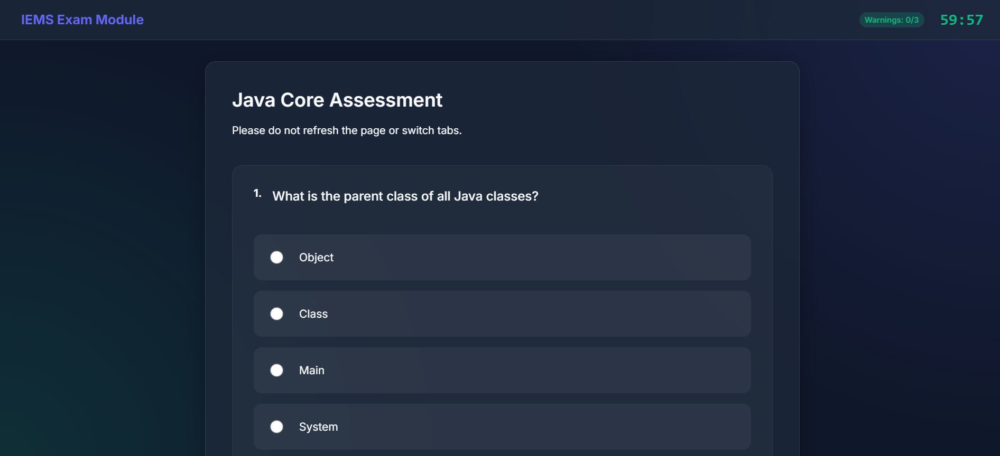
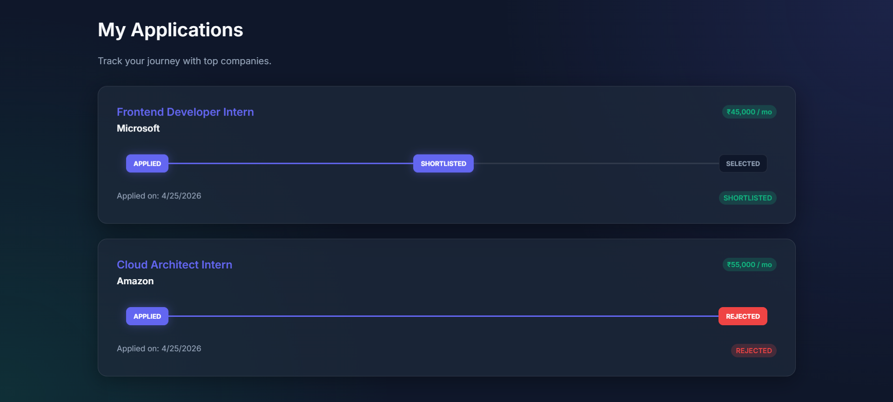
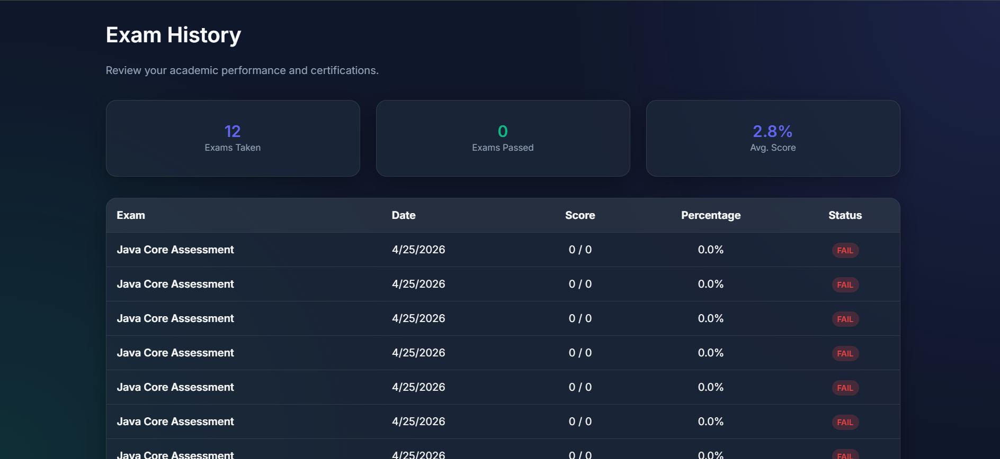

# Integrated Internship & Exam Management System (IEMS)

IEMS is a full-stack web application designed to streamline the process of managing internship applications and conducting secure online assessments. It provides role-based access for Administrators to manage the platform and Students to apply for opportunities and take certification exams.

## 🚀 Features

### 👨‍🎓 For Students
- **Internship Board:** Browse and apply for internships based on CGPA and domain.
- **Secure Exam Engine:** Take timed online assessments with built-in anti-cheat mechanisms (tab-switch detection).
- **Application Tracking:** Monitor the status of internship applications (Applied, Shortlisted, Selected, Rejected).
- **Performance History:** View past exam results, scores, and pass/fail statuses.
- **Profile Management:** Maintain academic details, CGPA, and technical skills.

### 👨‍💻 For Administrators
- **Command Center:** View high-level metrics (total applications, active internships, pending reviews).
- **Application Management:** Review student applications and update statuses.
- **Question Bank:** Create, edit, and manage exam questions and multiple-choice options.

## 🖼️ Screenshots

### 🔐 Login Page


### 🧑‍💻 Admin Dashboard


### 🎯 Internship Portal


### 📝 Exam Module




### 📊 Applications Tracking


### 📈 Exam History


## �️ Tech Stack

**Frontend:**
- React.js
- React Router DOM
- Axios (API integration)

**Backend:**
- Java 17 & Spring Boot 3
- Spring Security & JWT (Authentication)
- Spring Data JPA & Hibernate
- Flyway (Database Migrations)

**Infrastructure & Database:**
- MySQL 8.0
- Docker & Docker Compose (Multi-stage builds)

## 📋 Prerequisites

You do not need Java, Maven, or Node.js installed locally! The entire application is containerized. You only need:
- [Docker Desktop](https://www.docker.com/products/docker-desktop/) (or Docker Engine + Docker Compose)
- Git

## 🚀 Getting Started

### 1. Clone the repository
```bash
git clone https://github.com/DA-Shaurya/-Integrated-Internship-Exam-Management-System.git
cd -Integrated-Internship-Exam-Management-System
```

### 2. Start the Application
Run the following command to download the required images, build the application, and start the containers:
```bash
docker compose up --build -d
```
*Note: The first time you run this, it may take a few minutes as it downloads the Maven and Node images to compile the code.*

### 3. Access the Application
Once the containers are healthy and running, you can access the services here:
- **Frontend Web App:** [http://localhost:3000](http://localhost:3000)
- **Backend API:** `http://localhost:8081`
- **MySQL Database:** `localhost:3307` (Credentials: `root` / `rrrrr2005`)

## 🔐 Default Test Credentials

The database is automatically seeded with initial data and test users via Flyway migrations.

| Role | Email | Password |
| :--- | :--- | :--- |
| **Admin** | `shaurya@gmail.com` | `1234` |
| **Student** | `test@gmail.com` | `1234` |

## 🛑 Useful Docker Commands

**View live logs for all services:**
```bash
docker compose logs -f
```

**Stop the application:**
```bash
docker compose down
```
*(Your database data will persist safely in a Docker named volume).*

**Completely reset the database and wipe all data:**
```bash
docker compose down -v
```

## 📝 License

This project is licensed under the MIT License.
