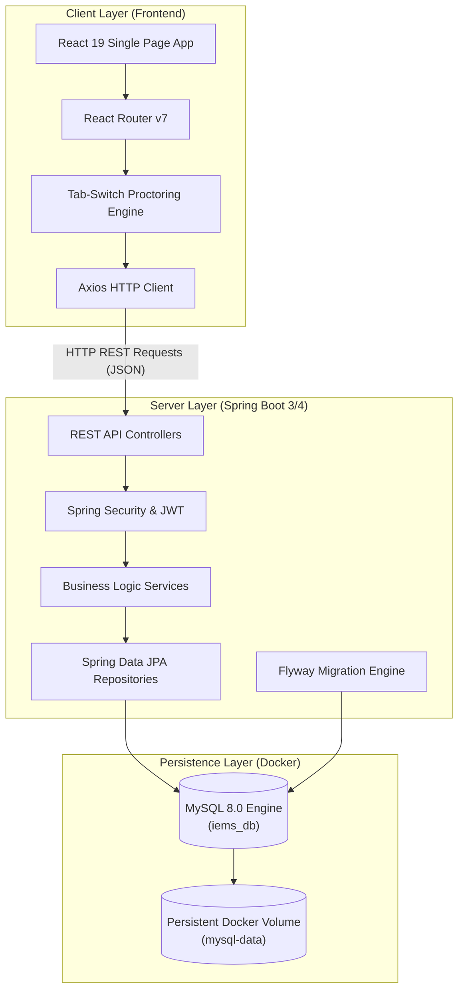

<div align="center">

# 🎓 Integrated Internship & Exam Management System (IEMS)

[](https://spring.io/projects/spring-boot)
[](https://www.oracle.com/java/)
[](https://react.dev/)
[](https://www.mysql.com/)
[](https://www.docker.com/)
[](https://opensource.org/licenses/MIT)

**A high-performance, full-stack enterprise platform bridging campus internship placement pipelines with secure, anti-cheat proctored examination workflows.**

[Key Features](#-key-features) • [System Architecture](#-system-architecture) • [Screenshots](#-ui-showcase) • [Tech Stack](#-tech-stack) • [Quick Start](#-quick-start-with-docker) • [API Reference](#-rest-api-reference) • [Default Credentials](#-default-test-credentials)

---

</div>

## 📌 Executive Summary

The **Integrated Internship & Exam Management System (IEMS)** simplifies and unifies the university and corporate recruitment lifecycle. Traditional placement processes face fragmentation across candidate registrations, opportunity listings, skill vetting, and result evaluations. 

IEMS delivers an all-in-one centralized portal featuring:
- **Zero-Setup Containerization:** Spin up the complete infrastructure (React client, Spring Boot backend, and MySQL database) with a single Docker Compose command.
- **Anti-Cheat Proctored Assessments:** In-browser examination environment featuring real-time tab-switch detection, violation tracking, countdown timer, and automated forced submission.
- **Dynamic Application Lifecycle:** Instant status updates transitioning candidates across `APPLIED`, `SHORTLISTED`, `SELECTED`, and `REJECTED` states.
- **Automated Database Migrations:** Production-ready schema management and seed data delivery powered by Flyway.

---

## 🚀 Key Features

### 👨‍🎓 Student Portal
- **🎯 Internship Discovery Board:** Explore curated internships filtering by role, domain, stipend, and minimum CGPA criteria.
- **⚡ Instant 1-Click Application:** Duplicate-guarded submission system linking student profiles directly to active recruitment drives.
- **📝 Secure Proctored Examination Suite:**
  - Automated dynamic countdown timer with auto-submit on expiry.
  - Continuous background auto-save for question answers.
  - Anti-cheat tab-switching and window-blur detection with real-time audit logging and forced submission upon strike limit exhaustion.
- **📊 Real-Time Application Tracking:** Dedicated tracker monitoring statuses (`APPLIED`, `SHORTLISTED`, `SELECTED`, `REJECTED`).
- **📈 Historical Performance Analytics:** Detailed scorecard logs displaying test attempts, obtained marks, percentage scores, and qualification statuses.
- **👤 Profile & Academic Management:** View and maintain student profiles, contact info, CGPA records, and technical domain specializations.

### 👨‍💻 Administrator Command Center
- **📊 Executive Metrics Dashboard:** Real-time visibility into total candidates, live internship listings, application volume, and pending evaluations.
- **📋 Candidate Pipeline Control:** Review applicant profiles, verify academic criteria, and transition application statuses with instant state updates.
- **💡 MCQ Question Bank Manager:** Author, edit, and organize exam categories, question texts, marks weighting, and multiple-choice options with answer keys.
- **🛡️ Security Audit Logs:** Monitor student assessment sessions with time-stamped tab-switch security events.

---

## 🖼️ UI Showcase

<div align="center">

### 🔐 Authentication & Role-Based Entry
*Secure credential authentication routing Students and Administrators to their dedicated control hubs.*
<br/>


---

### 👨‍💻 Administrator Command Center
*High-level overview of applicants, active internship drives, and administrative actions.*
<br/>


---

### 🎯 Student Internship Opportunities
*Clean, card-based interface showcasing open roles, company details, compensation, and eligibility.*
<br/>


---

### 📝 Anti-Cheat Proctored Examination Engine
*Live examination interface with timer controls, questions navigation, auto-save state, and blur proctoring.*
<br/>

<br/><br/>


---

### 📊 Application Lifecycle & Tracking
*Real-time transparency for candidates to monitor their application reviews and outcomes.*
<br/>


---

### 📈 Candidate Result & Score History
*Detailed breakdown of past test performances, marks obtained, and completion timestamps.*
<br/>


</div>

---

## 🏗️ System Architecture



### 🛡️ Exam Proctoring Workflow

```mermaid
sequenceDiagram
    autonumber
    actor Candidate as Student
    participant Browser as React Exam Engine
    participant Backend as Spring Boot API
    participant DB as MySQL Database

    Candidate->>Browser: Initiates Exam Session
    Browser->>Backend: POST /api/exam/start
    Backend->>DB: Record new ExamAttempt (IN_PROGRESS)
    Backend-->>Browser: Return Questions & Attempt ID
    
    rect rgb(30, 30, 45)
        Note over Candidate,Browser: Anti-Cheat Proctoring Active
        Candidate->>Browser: Switches Browser Tab / Blurs Window
        Browser->>Browser: Increment Violation Counter (strike += 1)
        Browser->>Backend: POST /api/audit/ (TAB_SWITCH event)
        Backend->>DB: Insert AuditLog record
        alt Violations < 3
            Browser-->>Candidate: Show Warning Notification Alert
        else Violations >= 3
            Browser->>Backend: POST /api/exam/submit (Forced Auto-Submit)
            Backend->>DB: Compute Score & Finalize Attempt
            Browser-->>Candidate: Terminate Exam (Security Disqualification)
        end
    end
```



---

## 🖼️ Screenshots

### 🔐 Login Page


### 🧑‍💻 Admin Dashboard


### 🎯 Internship Portal


### 📝 Exam Module


### 📊 Applications Tracking


### 📈 Exam History


## �️ Tech Stack

| Domain | Technology | Description |
| :--- | :--- | :--- |
| **Frontend Framework** | React.js (v19) | Modern component architecture, state management & hooks |
| **Routing** | React Router DOM (v7) | Client-side declarative routing and navigation guards |
| **HTTP Client** | Axios | RESTful network requests, interceptors & error handlers |
| **Backend Framework** | Spring Boot (v3.x / 4.x) | Enterprise REST API and business logic framework |
| **Language** | Java 17 | Core backend runtime environment |
| **Security & Auth** | Spring Security & JJWT | Stateless authentication, role validation & token handling |
| **ORM & Data Access** | Spring Data JPA / Hibernate | High-performance ORM and automated CRUD repositories |
| **Database Migrations**| Flyway | Versioned database schema and automated seed scripts |
| **Database** | MySQL 8.0 | Relational database engine |
| **Containerization** | Docker & Docker Compose | Multi-container isolation and deployment reproducibility |

---

## 📂 Project Structure

```bash
Integrated-Internship-Exam-Management-System/
├── docker-compose.yml          # Multi-container orchestration definition
├── README.md                   # Project documentation
├── images/                     # UI screenshots and visual assets
│   ├── admin.png
│   ├── applications.png
│   ├── exams.png
│   ├── exams2.png
│   ├── history.png
│   ├── internships.png
│   └── login.png
├── demo/                       # Spring Boot Backend Service
│   ├── Dockerfile              # Backend container build specification
│   ├── pom.xml                 # Maven dependencies & build configurations
│   ├── mvnw / mvnw.cmd         # Maven wrapper binaries
│   └── src/main/
│       ├── java/com/example/demo/
│       │   ├── DemoApplication.java     # Spring Boot application entry point
│       │   ├── config/                  # JWT utilities & Security configurations
│       │   ├── controller/              # RESTful API controllers
│       │   ├── model/                   # JPA database entity classes
│       │   ├── repository/             # Spring Data JPA repositories
│       │   └── service/                 # Core business logic services
│       └── resources/
│           ├── application.properties   # Database connection & server settings
│           └── db/migration/            # Flyway SQL migrations (V1 to V6)
└── frontend/                   # React Frontend Client
    ├── Dockerfile              # Frontend container build specification
    ├── package.json            # Node.js dependencies and script definitions
    ├── public/                 # Static assets and HTML template
    └── src/
        ├── App.js              # Application routes & layout routing
        ├── index.css           # Global theme styling
        ├── services/api.js     # Centralized Axios API client
        └── pages/              # Portal view components
            ├── AdminDashboard.js
            ├── ApplicationStatus.js
            ├── Dashboard.js
            ├── Exam.js
            ├── Internships.js
            ├── Login.js
            ├── Profile.js
            ├── QuestionBank.js
            ├── Register.js
            └── ResultHistory.js
```

---

## ⚡ Quick Start with Docker

> [!TIP]
> **No local installation of Java, Maven, or Node.js is required!** Docker handles the compilation, dependencies, and environment setup seamlessly.

### 1. Prerequisites
- [Docker Desktop](https://www.docker.com/products/docker-desktop/) (Version 20.10+ recommended)
- [Git](https://git-scm.com/)

### 2. Clone the Repository
```bash
git clone https://github.com/DA-Shaurya/Integrated-Internship-Exam-Management-System.git
cd Integrated-Internship-Exam-Management-System
```

### 3. Launch Services
Run the orchestrator command to build images and launch containers in detached mode:
```bash
docker compose up --build -d
```

### 4. Verify & Access
Once containers are healthy, open your browser:

| Application Component | URL / Endpoint | Default Credentials / Ports |
| :--- | :--- | :--- |
| **Frontend Web Portal** | [http://localhost:3000](http://localhost:3000) | Browser Client |
| **Backend REST API** | [http://localhost:8081](http://localhost:8081) | Spring Boot Server |
| **MySQL Database** | `localhost:3307` | User: `root` \| Password: `rrrrr2005` |

---

## 💻 Manual Local Development Setup

If you prefer running services directly on your host machine:

### Backend Setup (Spring Boot)
1. Ensure **JDK 17+** and **MySQL 8.0** are installed and running locally on port `3306`.
2. Create the target database:
   ```sql
   CREATE DATABASE iems_db;
   ```
3. Navigate to the backend directory and launch the application:
   ```bash
   cd demo
   ./mvnw spring-boot:run
   ```
   *(Windows Command Prompt / PowerShell: `.\mvnw.cmd spring-boot:run`)*
4. Backend will start listening on `http://localhost:8081`.

### Frontend Setup (React)
1. Ensure **Node.js (v18+)** and **npm** are installed.
2. Navigate to the frontend directory and install dependencies:
   ```bash
   cd frontend
   npm install
   ```
3. Start the React development server:
   ```bash
   npm start
   ```
4. Frontend will open automatically at `http://localhost:3000`.

---

## 🔐 Default Test Credentials

The database is pre-seeded with sample opportunities, questions, and test accounts via Flyway migrations:

| Role | Account Email | Password | Access Privileges |
| :--- | :--- | :--- | :--- |
| 🛡️ **Administrator** | `shaurya@gmail.com` | `1234` | Command Center, Question Bank, Status Transitions |
| 👨‍🎓 **Candidate / Student** | `test@gmail.com` | `1234` | Internship Board, Proctored Exams, Score History |

---

## 📡 REST API Reference

### 🔑 Authentication
| Method | Endpoint | Description |
| :--- | :--- | :--- |
| `POST` | `/api/auth/register` | Register new student profile (Returns JWT & profile details) |
| `POST` | `/api/auth/login` | Authenticate user credentials (Returns JWT & role) |

### 💼 Internships & Applications
| Method | Endpoint | Description |
| :--- | :--- | :--- |
| `GET` | `/api/internships` | Retrieve all active internship openings |
| `POST` | `/api/applications/apply` | Submit student application for an internship posting |
| `GET` | `/api/applications/student/{id}` | Fetch application statuses for a specific student |
| `PUT` | `/api/applications/{id}/status` | Update candidate application state (*Admin only*) |

### 📝 Examinations & Proctoring
| Method | Endpoint | Description |
| :--- | :--- | :--- |
| `POST` | `/api/exam/start` | Initialize an exam attempt session |
| `GET` | `/api/questions/exam/{id}` | Retrieve MCQ question list with options for an exam |
| `POST` | `/api/answers/save` | Real-time auto-save for student selected options |
| `POST` | `/api/exam/submit` | Finalize examination attempt and calculate score |
| `POST` | `/api/audit/` | Log security events (e.g., `TAB_SWITCH` infractions) |
| `GET` | `/api/results/student/{id}` | Retrieve comprehensive exam result history for a student |

### ⚙️ Administration & Question Bank
| Method | Endpoint | Description |
| :--- | :--- | :--- |
| `GET` | `/api/admin/metrics` | Aggregate platform statistics and candidate counters |
| `POST` | `/api/admin/questions` | Create new MCQ questions and option keys |
| `DELETE`| `/api/admin/questions/{id}` | Remove a question from the question repository |

---

## 🛑 Useful Docker Commands

```bash
# View aggregated live logs across all containers
docker compose logs -f

# View live logs for backend only
docker compose logs -f backend

# Stop all running containers
docker compose down

# Stop containers and wipe MySQL volume (cleans database completely)
docker compose down -v

# Rebuild containers from scratch without cache
docker compose build --no-cache
```

---

## 🗺️ Roadmap & Future Enhancements

- [x] Full Docker Compose containerization & Flyway migrations
- [x] Automated tab-switch anti-cheat detection & event audit logging
- [x] MCQ Question Bank manager with answer key validation
- [ ] BCrypt password hashing implementation for production hardening
- [ ] Automated resume parsing and PDF preview in Admin dashboard
- [ ] WebRTC webcam proctoring for live anti-cheat verification
- [ ] Automated email notifications for application status updates

---

## 🤝 Contributing

Contributions are welcomed! Feel free to report issues, suggest features, or submit pull requests.

1. **Fork** the Project
2. Create your Feature Branch (`git checkout -b feature/AmazingFeature`)
3. Commit your Changes (`git commit -m 'Add some AmazingFeature'`)
4. Push to the Branch (`git push origin feature/AmazingFeature`)
5. Open a **Pull Request**

---

## 📄 License

Distributed under the **MIT License**. See `LICENSE` for more information.

---

<div align="center">
  <sub>Built with ❤️ by <a href="https://github.com/DA-Shaurya">DA-Shaurya</a></sub>
</div>